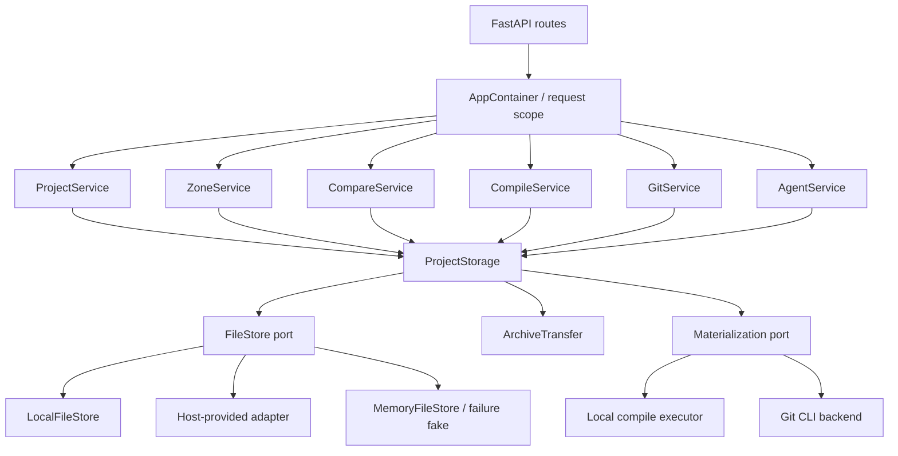

# paper-diff 文件访问层抽象与宿主系统集成计划

> 状态：实施中（Phase 0–5、7、8 已完成；Phase 6 的 project-local Git lease 仍可继续加固）
>
> 日期：2026-07-19
>
> 目标版本：v2.x（保持现有 HTTP API 与磁盘布局兼容）
>
> 主要范围：`apps/api` 的持久化文件、项目树、归档、快照、编译产物、Git 工作区及启动清理

## 0. 实施进度（2026-07-19）

| 阶段 | 当前状态 | 已落地内容 | 剩余项 |
|---|---|---|---|
| Phase 0 | 完成 | characterization、二进制 undo 用例、业务层物理 I/O 强制 AST 守卫 | 持续随新增能力扩充语料 |
| Phase 1 | 完成 | `StorageKey`、`FileStore`、Local/Memory adapter、CAS、原子写、整树 staging/replace、共享契约测试 | failure-injection fake 可继续丰富 |
| Phase 2 | 完成 | `ProjectLayout`、`ProjectStorage`、真实 namespace 前缀、`AppContainer`、固定/按请求 container resolver | 宿主鉴权本身由外层系统负责 |
| Phase 3 | 完成 | Project/Zone/Agent 主路径全部迁移；ZIP/TAR 统一；流式 entry 发布；原始字节快照与二进制 undo | 更细的归档配额/保留策略 |
| Phase 4 | 完成 | Compare、raw/meta/slice/file-pair/diff-index 统一走 `ProjectStorage`；纯文本算法移至 domain | 可选 range-reader 性能扩展 |
| Phase 5 | 完成（待环境 smoke） | 编译业务门面、可注入 executor、scratch materialization lease、jobs/log/artifacts 白名单写回、work 不回写测试 | 当前环境没有 Docker CLI；在具备镜像的环境补跑 smoke |
| Phase 6 | 基本完成 | `GitService` 门面、可注入 backend、CLI/Path 全部移入 integration；archive/restore/zone 发布走存储层 | project-local `.git` 仍使用 Local provider 直通路径，后续可升级为持久 lease；远端凭据不在本计划范围 |
| Phase 7 | 完成 | `StorageAdmin.clear_namespace`、危险路径保护、业务层零物理 I/O、零 `Workspace/Path/shutil/subprocess` import、硬门禁；旧 `Workspace` 兼容壳已删除 | 无 |
| Phase 8 | 完成 | Memory HostFake 完整主路径、固定/按请求 namespace 隔离、能力降级、自定义 Git/compile 注入、宿主指南与能力矩阵 | 生产宿主 adapter 由集成方按协议实现 |

当前验证基线：API 非 Docker **113 项**、Web **227 项**及 Vue 类型检查通过；核心 API 可在不使用 `LocalFileStore` 的情况下运行。本文后续审计数字保留为实施前基线，不代表当前剩余债务。

## 1. 结论摘要

当前仓库已经有 `app.infra.workspace_fs.Workspace`，但它不是完整的文件访问边界。它只封装了部分文本文件、项目元数据和目录遍历；业务服务仍直接持有 `Path`，并直接调用 `open`、`read_bytes`、`write_bytes`、`mkdir`、`unlink`、`shutil`、`zipfile`、`tarfile` 和 `tempfile`。

按本次静态审计口径，`apps/api/app` 中除 `workspace_fs.py` 外约有 **132 处直接文件 I/O 调用点**，主要集中在：

| 模块 | 直接 I/O 调用点（约） | 主要职责泄漏 |
|---|---:|---|
| `project_service.py` | 61 | 项目枚举、ZIP/TAR 导入、补充文件、快照、accept、undo、导出 |
| `compile_service.py` | 23 | jobs、logs、artifacts、latexdiff 临时树、编译源目录 |
| `git_service.py` | 17 | `.gitignore`、外部仓库同步、archive 解包、zone 物化 |
| `zone_service.py` | 14 | zone 元数据、文件导入、删除、克隆 |
| `compare_service.py` | 13 | 文件存在性判断、二进制读取、哈希 |
| `main.py` | 4 | 启动时工作区遍历和删除 |

此外，Git 和编译还存在约 18 个 `subprocess`/Docker 本地路径接触点。它们意味着仅增加一个 `read_bytes/write_bytes` 接口仍不足以支持未来宿主系统或对象存储：Git CLI 和 Docker 必须拿到真实本地目录。因此目标设计必须同时提供：

1. 统一的逻辑文件访问端口；
2. 面向 paper-diff 目录模型的项目存储门面；
3. 安全、可回收、可限制写回范围的“本地物化租约”；
4. 可由宿主系统注入的存储适配器和请求命名空间；
5. 禁止业务层重新出现直接文件 I/O 的自动化守卫。

最终状态应满足：`app/services`、`app/api`、`app/main.py` 不再执行物理文件操作，也不接收或返回 `pathlib.Path`；所有实际磁盘/对象存储访问集中在 `app/storage` 适配器中，Git/Docker 只能通过受控物化接口接触本地路径。

## 2. 本次审计范围与边界

### 2.1 纳入范围

- 项目根、`work/`、`zones/{id}/tree/`、`base/`、`revised/`；
- `meta.json`、zone `meta.json`；
- `snapshots/`、`jobs/`、`artifacts/`、`latexdiff_work/`；
- 项目本地 `.git/` 及绑定的外部本地 Git 仓库；
- ZIP/TAR 导入、ZIP 导出、Git archive；
- 编译时 Docker 挂载目录及编译产生的 PDF/AUX/BBL/log；
- 启动时工作区创建、枚举和条件清理；
- 项目列表所依赖的文件时间、大小、哈希和存在性查询；
- 并发元数据更新、原子替换、失败回滚和路径安全。

### 2.2 不纳入本轮持久化抽象

- 前端 `File.arrayBuffer()`：它属于浏览器上传边界，数据进入 API 后才交给项目存储；
- 前端 `localStorage`：它保存 UI 偏好，不是论文项目文件；
- FastAPI `UploadFile.read()` 和 HTTP `Response`：它们属于传输层；后续可单独优化为流式上传/下载；
- `domain/root_detect.py`、`domain/media.py` 中只解析文件名后缀的纯字符串逻辑；这些可改用 `PurePosixPath`，但不属于物理 I/O；
- 远程 Git 凭据、多租户鉴权和 Git push 的业务实现；本计划只保留可扩展边界。

测试代码可直接使用 `tmp_path` 搭建适配器契约和外部 Git fixture，但生产业务目录应受静态守卫约束。

## 3. 当前结构的关键问题

### 3.1 `Workspace` 暴露物理布局

`Workspace` 对外公开 `project_dir`、`work_dir`、`zone_dir()`、`snapshots_dir`、`meta_path` 等 `Path`。服务拿到路径后继续自行读写，导致封装可以被随时绕过。`_side_dir()` 和 `resolve_under()` 甚至被业务直接调用，表明它目前更像路径帮助类而不是存储端口。

### 3.2 文件语义分散并重复

- ZIP 安全解包在 `ProjectService._safe_extract_zip()`；`ZoneService` 反向实例化 `ProjectService` 调用私有方法；
- TAR 解包分别出现在 Git 双 ref 导入、Git restore、Git zone-from-commit；
- zone 元数据和 project 元数据使用不同写入方式；project 元数据原子写，zone 元数据直接覆盖；
- 文本解码、二进制判断、哈希、文件 meta 在多个服务重复组合；
- accept/undo 自行操作快照，且二进制文件快照只保存空文本标记，无法可靠恢复被删除或替换的二进制内容。

### 3.3 替换整棵树不是事务

现有 ZIP 导入和某些 Git 导入会先删除目标目录，再逐个写入。若解压、磁盘或进程中途失败，项目会留下半棵树。未来对象存储没有真正目录和原子 rename，更需要把“构建新 generation”和“发布 generation”定义成存储层语义。

### 3.4 元数据并发只覆盖单进程线程

`meta.json` 使用进程内 `RLock` 和原子 `os.replace`，能防止同一 Python 进程内部分竞争，但无法防止：

- 多 worker / 多实例同时 mutate；
- 后台 compare、compile 与 HTTP 请求并发写入；
- 宿主存储中的版本覆盖。

统一存储接口需要提供版本令牌/CAS（compare-and-swap），`mutate_meta` 基于 CAS 重试，而不是把正确性建立在全局字典锁上。

### 3.5 Git 和编译隐式要求本地路径

- `git` CLI 依赖真实仓库目录和 `.git/`；
- Docker `-v` 依赖可挂载的宿主绝对路径；
- latexmk 当前直接在 `work/` 内产生中间文件，编译会污染项目真值树；
- latexdiff 直接复制两棵目录到项目内临时路径。

未来存储如果是宿主 API、数据库或对象存储，这些路径不存在。必须显式声明并隔离“物化到本地”的能力，且编译结果只能按白名单写回 artifacts/jobs，不能把临时文件自动同步回 work。

### 3.6 依赖构造无法被宿主替换

路由每次根据 `Settings` 新建服务；服务又自行新建 `Workspace`、`ZoneService`、`CompareService` 和 `GitService`。这会绕过宿主注入，也形成 `ProjectService ↔ ZoneService`、`ProjectService → GitService/CompareService` 的隐式耦合。

## 4. 设计目标与设计锁定

### 4.1 必须满足

1. 业务层只使用逻辑引用，不使用物理路径。
2. 所有读取、写入、枚举、stat、复制、移动、删除、整树替换、JSON 原子更新都通过统一存储调用。
3. 默认本地适配器保持当前磁盘布局和 API 行为，迁移期间不移动用户数据。
4. 存储适配器可以由更大系统在 `create_app` 时注入，并能附带 tenant/namespace 上下文。
5. 路径规范化、越界防护、符号链接策略、归档 entry 校验只实现一次。
6. 支持二进制文件、Unicode 文件名、空文件、大文件流式读写和稳定排序。
7. 项目/zone 元数据更新具有原子性及并发冲突语义。
8. Git/编译对本地路径的访问只能出现在基础设施适配器内，并由 lease 生命周期管理。
9. 现有 API 测试、Git 测试、非 Docker 测试全部保持通过。
10. 有自动化规则阻止直接 I/O 再次进入业务层。

### 4.2 本轮明确不采用

- 不把 `pathlib.Path` 换成另一套字符串拼接后继续让服务直接操作；
- 不建立一个包含所有业务方法的超大 `Workspace` God Object；
- 不在第一阶段把所有服务改成 async；当前服务和后台线程以同步 SPI 为基线，接口提供流式 reader/writer，避免把整个文件强制加载进内存；
- 不要求首轮同时实现 S3/数据库生产适配器；但会提供内存 fake、完整契约测试和宿主适配说明，保证替换点真实可用；
- 不长期保留“部分走新接口、部分直接 Path”的混合状态。

## 5. 目标架构



采用两层抽象：

- `FileStore` 是低层、与业务无关的文件对象端口；
- `ProjectStorage` 是 paper-diff 专用门面，负责布局、meta、tree、snapshot、job、artifact 等语义。

业务服务统一依赖 `ProjectStorage`，不直接依赖 `LocalFileStore`。这样既避免业务了解 `work/` 等物理拼接细节，也不会把 paper-diff 业务语义塞进通用对象存储协议。

## 6. 新模块布局

计划新增以下包：

```text
apps/api/app/storage/
  __init__.py
  types.py                 # StorageKey、StorageScope、FileInfo、VersionToken、能力枚举
  errors.py                # 存储异常，不暴露 OSError/SDK 异常
  ports.py                 # FileStore、Materializer 协议
  layout.py                # ProjectLayout：逻辑资源到 StorageKey 的唯一映射
  project_store.py         # ProjectStorage 高层门面
  metadata.py              # project/zone JSON 原子读写与 CAS mutate
  archives.py              # ZIP/TAR 安全导入、ZIP 导出
  snapshots.py             # 文本/二进制统一快照与恢复
  factory.py               # standalone 默认适配器与宿主注入入口
  adapters/
    local.py               # 唯一允许 pathlib/open/os/shutil/tempfile 的主适配器
    memory.py              # 契约测试和服务单测 fake
    local_materializer.py  # 本地直通或远端下载到临时目录的 lease

apps/api/app/composition/
  container.py             # AppContainer、服务生命周期和 request scope

apps/api/app/integrations/
  git_backend.py           # GitBackend 协议
  git_cli.py               # 唯一允许 Git CLI 接触物化路径的实现
  compile_executor.py      # Docker/latexmk 执行器，输入/输出为 lease/result
```

迁移完成后：

- 删除或保留一个仅转发且标记 deprecated 的 `infra/workspace_fs.py` 兼容壳；最终业务代码不得再 import `Workspace`；
- `docker_mount.py` 合并到 compile executor 或只接受 materialization lease 的 local path；
- `Workspace` 中纯函数（文本解码、行切片、splice、hash）迁到 `domain/text_file.py`，避免把纯算法绑在存储对象上。

## 7. 核心类型与接口草案

以下是语义草案，不要求逐字照搬，但实现必须保留这些能力边界。

```python
@dataclass(frozen=True)
class StorageScope:
    namespace: str          # standalone 默认为 "default"；宿主可映射 tenant/workspace
    project_id: str

@dataclass(frozen=True)
class StorageKey:
    value: str              # 仅规范化后的 POSIX 相对 key；不可为空、绝对或含 ..

@dataclass(frozen=True)
class FileInfo:
    key: StorageKey
    kind: Literal["file", "prefix"]
    size: int | None
    modified_at: datetime | None
    version: str | None     # 本地可使用内容/mtime token，宿主可用 ETag/version id

class FileStore(Protocol):
    capabilities: StorageCapabilities

    def stat(self, key: StorageKey) -> FileInfo | None: ...
    def list(self, prefix: StorageKey, *, recursive: bool) -> Iterable[FileInfo]: ...
    def open_read(self, key: StorageKey) -> BinaryIO: ...
    def write(self, key: StorageKey, source: BinaryIO, *, expected: str | None = None) -> FileInfo: ...
    def delete(self, key: StorageKey, *, recursive: bool = False) -> None: ...
    def copy(self, source: StorageKey, target: StorageKey) -> None: ...
    def move(self, source: StorageKey, target: StorageKey) -> None: ...
    def replace_prefix(self, target: StorageKey, staged: StorageKey) -> None: ...

class Materializer(Protocol):
    @contextmanager
    def lease(self, refs: Sequence[MaterializeRef], *, mode: LeaseMode) -> Iterator[LocalLease]: ...
```

`ProjectStorage` 公开业务需要的统一调用，例如：

```python
project = storage.for_project(scope)
project.exists()
project.list_tree(TreeRef.work())
project.read_text(TreeRef.work(), rel_path)
project.read_bytes(TreeRef.zone(zone_id), rel_path)
project.write_text(...)
project.write_bytes(...)
project.stat_file(...)
project.delete_file(...)
project.copy_file(...)
project.replace_tree(tree_ref, entries)
project.merge_tree(tree_ref, entries, conflict_policy)
project.load_project_meta()
project.mutate_project_meta(mutator)
project.load_zone_meta(zone_id)
project.save_zone_meta(zone_id, meta)
project.create_snapshot(...)
project.restore_snapshot(...)
project.save_job(...)
project.save_artifact(...)
project.export_zip(tree_ref)
```

所有相对路径首先构造成 `RelativeFilePath`/`StorageKey`。校验至少包括：

- 拒绝绝对路径、盘符、空路径、NUL、`.`/`..` 越界片段；
- 统一 `\` 为 `/`；
- 拒绝通过本地 symlink 逃逸根目录；
- zone/project/snapshot/job id 使用独立的 segment 校验，不允许斜杠；
- 业务服务不能调用 `resolve_under` 获得真实路径。

## 8. 逻辑布局与兼容策略

`ProjectLayout` 是磁盘/对象 key 映射的唯一来源：

| 逻辑引用 | 当前兼容 key |
|---|---|
| project meta | `{project_id}/meta.json` |
| work tree | `{project_id}/work/**` |
| zone meta | `{project_id}/zones/{zone_id}/meta.json` |
| zone tree | `{project_id}/zones/{zone_id}/tree/**` |
| legacy base/revised | `{project_id}/{base,revised}/**` |
| snapshot | `{project_id}/snapshots/**` |
| compile job/log | `{project_id}/jobs/**` |
| artifact | `{project_id}/artifacts/**` |
| local Git | `{project_id}/.git/**`（只供 Git backend lease 使用） |
| scratch | provider 管理的临时命名空间，不作为业务持久布局 |

首轮 `LocalFileStore` 原地读取现有目录，不做数据迁移。对象存储适配器可以在内部增加 generation/pointer，但对 `ProjectStorage` 暴露相同逻辑引用。

`merged` 继续作为 `work` 的逻辑别名，仅在 `ProjectStorage` 中定义一次，不再让各服务重复判断。

## 9. 关键语义设计

### 9.1 原子元数据更新

`read_json` 返回 `(document, version_token)`；`write_json` 可携带 `expected_version`。`mutate_project_meta`：

1. 读取 meta 和版本；
2. 在副本上执行纯 mutator；
3. 使用 CAS 写入；
4. 冲突时有限次重读重试；
5. 重试耗尽抛 `StorageConflict`，映射为明确的 409，而非静默覆盖。

本地适配器继续使用同目录临时文件、flush/fsync、`os.replace`，并补充跨进程锁或版本校验。zone meta 与 job JSON 使用同一原子写协议。

### 9.2 整树替换与导入

ZIP/Git 全量导入不能直接清空正式前缀。统一流程：

1. 在 staging generation 中逐项校验和写入；
2. 计算 entry count、总展开大小和文件摘要；
3. 完成后一次 `replace_prefix` 发布；
4. 失败时删除 staging，正式树保持原样；
5. 发布后异步/尽力清理旧 generation。

本地适配器用同文件系统的临时目录 + rename；对象存储适配器可用 manifest/pointer 切换。

### 9.3 归档安全

`ArchiveTransfer` 统一 ZIP/TAR 策略：

- 禁止绝对路径、`..`、驱动器路径、symlink/hardlink/device entry；
- 忽略 `__MACOSX`、AppleDouble 和系统垃圾文件；
- 保留现有 GBK/GB18030/Big5 文件名恢复逻辑；
- 配置最大 entry 数、单文件大小、总展开大小及压缩比，防 ZIP bomb；
- 逐块复制，不把 500MB 上传和所有 entry 同时载入内存；
- ZIP 导出从 `FileStore.open_read()` 流式写入，不调用 `ZipFile.write(local_path)`；
- TAR 只作为 Git backend 的受控数据流，业务服务不直接接触 `tarfile`。

### 9.4 快照与 undo

快照改为内容寻址/manifest 语义，至少记录：

- 原文件是否存在；
- kind（text/binary）；
- 原始 bytes 或 blob reference；
- sha256、size、原 revision；
- 对应操作和目标路径。

这样 add/delete/replace_all 对二进制文件也能完整 undo。写文件、保存快照和更新 meta 不能做到跨 provider 强事务时，采用“先快照、后写文件、最后 CAS 更新 meta”的可恢复顺序，并增加 orphan snapshot 清理策略。

### 9.5 本地物化租约

`LocalLease` 具有：

- 唯一临时目录；
- 明确的只读/读写模式；
- 输入 tree/ref 列表；
- 写回白名单；
- 到期和退出清理；
- 最大字节/文件数限制；
- provider capability 信息。

对于本地适配器，允许在安全情况下使用原地只读直通；需要写入或可能污染源树时仍使用 scratch 副本。

编译必须改为：materialize work 为只读输入 → 在 scratch 输出目录运行 latexmk → 读取 PDF/AUX/BBL/log → 通过 `ProjectStorage` 保存 artifacts/jobs → 销毁 lease。编译中间文件不再出现在 `work/`。

Git 必须改为由 `GitBackend` 管理本地 lease。`GitService` 只调用 `status/log/show/archive/commit/restore` 等 Git 领域操作，不拼接外部路径，也不直接复制文件。对不支持 Git materialization 的宿主适配器返回明确 `STORAGE_CAPABILITY_UNAVAILABLE`，不能退回偷偷访问本地磁盘。

## 10. 依赖注入与宿主接入

新增 `AppContainer`，由 `create_app(container: AppContainer | None = None)` 接受宿主注入；standalone 模式从 `Settings` 构造默认容器。

容器至少持有：

- `StorageFactory` / `ProjectStorageFactory`；
- `GitBackend`；
- `CompileExecutor`；
- 服务实例或服务 factory；
- `RequestScopeProvider`，把宿主用户/tenant 映射成 `StorageScope.namespace`。

路由依赖从 `request.app.state.container` 获取服务，不再每次 `ProjectService(settings)`。后台 compare/compile 任务必须捕获同一个 scope 与 storage dependency，不能在 worker 内根据全局 Settings 重建。

服务构造函数目标形态：

```python
ProjectService(projects, comparer, git_backend)
ZoneService(projects, archives)
CompareService(projects, executor)
CompileService(projects, compile_executor, events)
GitService(projects, git_backend)
AgentService(projects, project_service, provider)
```

为避免循环依赖，归档、Git、compare 等能力通过显式端口组合，不允许服务实例化另一个服务后调用其私有方法。

## 11. 现有操作到目标调用的映射

| 现有行为 | 目标统一调用 |
|---|---|
| `workspace_root.iterdir()` 项目枚举 | `projects.list_projects(scope_namespace)` |
| `meta_path.exists/read_text` | `project.exists/load_project_meta` |
| `ws.resolve_under(...).read_bytes()` | `project.read_bytes(tree_ref, path)` |
| `target.parent.mkdir + write_bytes` | `project.write_bytes(...)` |
| `shutil.copy2/copytree` | `project.copy_file/copy_tree` |
| `shutil.rmtree` | `project.delete_tree` |
| ZIP/TAR 逐项解包 | `archives.import_tree(...)` |
| `ZipFile.write(full_path)` | `archives.export_tree(...)` |
| 快照直接写 `.txt` | `project.create_snapshot(...)` |
| job JSON/log 直接读写 | `project.save_job/load_job/save_job_log` |
| artifact 复制/读取 | `project.save_artifact/read_artifact` |
| startup 直接清空 root | `storage_admin.clear_namespace(...)` |
| Docker 直接挂载 `work_dir` | `compile_executor.run(materialized_lease, spec)` |
| Git CLI 直接使用 repo `Path` | `git_backend.*(repository_binding, ...)` |

## 12. 分阶段实施计划

每个阶段都应可单独合并，并保持非 Docker API 测试通过。建议一阶段一提交或一组可回滚提交。

### Phase 0：行为基线与审计守卫

目标：在重构前锁住现有外部行为，并把“不得新增直接 I/O”变成可验证规则。

工作项：

1. 为项目创建/枚举、Unicode ZIP、二进制 import/export、zone clone、accept/undo、Git restore、compile artifact 补 characterization tests；
2. 增加二进制 undo 的失败测试，先标记为待修复；
3. 新增 AST/rg 守卫测试，初期只报告 allowlist，迁移一个模块就收紧一个模块；
4. 记录直接 I/O inventory 作为测试 fixture 或文档附录；
5. 明确 API JSON、错误码、磁盘布局的兼容快照。

完成条件：现有行为基线稳定；CI 能发现业务层新增 `open`、`Path.read/write`、`shutil`、`tempfile`、`zipfile/tarfile`。

### Phase 1：存储内核与本地适配器

目标：先建立可证明语义一致的端口，不改业务行为。

工作项：

1. 实现 `types.py`、`errors.py`、`ports.py`、`layout.py`；
2. 实现 `LocalFileStore`，所有本地路径解析和 symlink 防逃逸集中于此；
3. 实现 `MemoryFileStore` 与 failure-injection fake；
4. 建立 provider contract test suite，同一套测试运行于 local/memory；
5. 实现 streaming、stat、list、atomic write、CAS、copy/move/delete、replace_prefix；
6. 将 `Workspace` 临时改成委托给 `ProjectStorage` 的兼容壳，确保旧服务测试继续通过。

完成条件：local/memory 通过同一契约；现有 API 无行为变化；`Workspace` 自身不再直接承载业务扩展。

### Phase 2：项目布局、元数据和应用容器

目标：建立真正可注入的统一项目门面。

工作项：

1. 实现 `ProjectStorage`、`ProjectLayout`、project/zone/job JSON repository；
2. 把 meta 的锁和 CAS 语义移入 storage；
3. 新增 `AppContainer`、standalone factory、request namespace provider；
4. 改造路由依赖，从容器获取服务；
5. 服务构造函数先接受 `ProjectStorageFactory`，保留短期 Settings fallback 仅供兼容测试；
6. 后台任务显式传递 scope/storage，不读取全局实例。

完成条件：测试可注入 MemoryFileStore；两个 namespace 中同名 project id 互不影响；服务不再自行 `Workspace(settings.workspace_root, id)`。

### Phase 3：Project/Zone/Agent 迁移与归档统一

目标：优先迁移 I/O 数量最多、互相耦合最严重的服务。

工作项：

1. 实现 `ArchiveTransfer`、整树 staging 发布、流式 ZIP export；
2. `ProjectService` 的 create/list/import/file/raw/accept/undo/export 全部改用 `ProjectStorage`；
3. `ZoneService` 的 meta、tree、import、delete、clone 全部改用 `ProjectStorage`；
4. 去掉 `ZoneService → ProjectService._safe_extract_zip`；
5. 实现统一 snapshots，修复二进制 undo；
6. `AgentService` 使用注入的 ProjectService/ProjectStorage，不自行建 Workspace；
7. 移走 `ProjectService` 中 ZIP/TAR/shutil/tempfile/Path I/O import。

完成条件：`project_service.py`、`zone_service.py`、`agent_service.py` 无直接物理 I/O；全量导入失败不会破坏旧 tree；二进制 add/delete/replace 可 undo。

### Phase 4：Compare 与所有读取 API 迁移

目标：统一 text/binary/meta/slice/hash 读取路径。

工作项：

1. 将 decode、line count、slice、splice、hash 移到纯 `domain/text_file.py`；
2. `CompareService` 只用 `stat/read_text/read_bytes/hash`；
3. work/zone raw、meta、slice、file-pair、diff-index 只调用 ProjectStorage；
4. 统一 `FileInfo` 和文件存在性判断，去掉 `Path.is_file/stat/read_bytes`；
5. 验证大文件 slice 不因抽象退化为重复全目录复制；必要时增加 range reader 能力。

完成条件：`compare_service.py` 无 `Path` 或直接 I/O；文本解码和哈希在 Git/show、work、zone 路径行为一致。

### Phase 5：编译物化和 artifacts/jobs 迁移

目标：解除 CompileService 对真实工作区目录的依赖，并避免污染 work。

工作项：

1. 定义 `CompileExecutor` 输入/输出 DTO；
2. 实现 local materialization lease 和 Docker executor；
3. latexmk 在 scratch 中运行，输入 tree 只读；
4. PDF/AUX/BBL/log/job JSON 通过 ProjectStorage 保存；
5. latexdiff 的 base/revised scratch 由 materializer 构建，不在项目内创建 `latexdiff_work`；
6. lease 超时、取消、异常时清理；
7. 增加“不写回 work”的断言和 materializer failure tests。

完成条件：`compile_service.py` 无 `Path/shutil/read/write`；Docker 只接收 lease path；编译前后 work tree 摘要不变。

### Phase 6：Git backend 与外部仓库边界迁移

目标：业务 Git 语义与本地 CLI/文件系统完全解耦。

工作项：

1. 定义 `GitBackend` 的 status/log/diff/show/ls-tree/archive/commit/restore 接口；
2. 将 subprocess 和 repo Path 全部移到 `integrations/git_cli.py`；
3. project-local Git 通过 storage materializer/本地 provider capability 管理；
4. external repo 由 `RepositoryBinding` 解析，不把 Path 暴露给业务服务；
5. work ↔ repo 同步通过 ProjectStorage stream，而不是 `src.read_bytes/dest.write_bytes`；
6. Git archive 交给 ArchiveTransfer 写入 staging tree；
7. 对不支持 materialization 的 provider 返回能力错误；
8. 保持 status/log/diff/show/restore/zone-from-commit API 兼容。

完成条件：`git_service.py` 无 `Path/shutil/tarfile/subprocess`；只有 Git CLI adapter 可以接触 repo lease 路径。

### Phase 7：启动清理、旧接口删除和强制守卫

目标：关闭所有旁路。

工作项：

1. `clear_workspace_if_enabled` 改用 `StorageAdmin.clear_namespace`；
2. 保留现有危险路径保护，并把“只清理当前 namespace”变成适配器契约；
3. 删除 `Workspace` 兼容壳或确保生产代码零 import；
4. 收紧 AST 守卫：`app/services`、`app/api`、`app/main.py` 禁止物理文件 I/O；
5. 只允许 `app/storage/adapters`、`app/integrations/git_cli.py`、`compile_executor.py` 使用物理路径；
6. 搜索并清零业务层 `workspace_root`、`project_dir`、`work_dir`、`resolve_under` 暴露；
7. 更新 README、AGENTS 和架构文档。

完成条件：生产业务层不存在直接 I/O；CI 守卫无 allowlist 债务；当前磁盘数据无需迁移即可启动。

### Phase 8：宿主系统适配包与演练

目标：证明抽象确实可集成，而不只是本地实现换名字。

工作项：

1. 编写 host adapter 指南、能力矩阵和最小示例；
2. 用 Memory/HostFake 启动完整 FastAPI，并跑 project/work/zone/compare API；
3. 演练 namespace/tenant 隔离；
4. 演练 provider 不提供 materialization 时，普通文件能力正常、Git/compile 明确降级；
5. 演练 provider 提供 materialization 时 Git/compile 完整通过；
6. 输出宿主需要实现的端口、生命周期、错误映射、配额和可观测性约定。

完成条件：不设置 `PAPER_DIFF_WORKSPACE_ROOT`、不使用 LocalFileStore，也能通过核心 API 测试；宿主只需提供 adapter/container，不需要修改业务服务。

## 13. 测试矩阵

### 13.1 FileStore 契约测试

- 路径规范化、Unicode、空文件、二进制、大小写行为；
- traversal、绝对路径、盘符、NUL、symlink escape；
- list 的递归/非递归、稳定排序、stat/version；
- 流式大文件读写，不要求一次性 bytes；
- atomic write、expected version、CAS conflict；
- copy/move/delete/replace_prefix；
- 中途失败时正式 tree 不变，staging 可清理；
- namespace 隔离；
- local 与 memory/fake 运行相同用例。

### 13.2 ProjectStorage 语义测试

- 现有 v2 布局映射与 merged→work alias；
- project/zone meta 并发 mutate 不丢更新；
- text fallback encoding 与 hash；
- work/zone/base/revised 文件读取一致；
- snapshots 对 text/binary/missing file 都可恢复；
- jobs/artifacts latest 与 job-specific 版本；
- list_projects 不依赖真实目录 mtime；meta 应写 `updated_at` 作为稳定排序依据。

### 13.3 Archive 测试

- 中文文件名、GBK mojibake 恢复；
- ZIP slip、TAR traversal、symlink/hardlink/device 拒绝；
- ZIP bomb 限额；
- 单顶层目录 hoist 规则兼容；
- 导入失败回滚；
- 二进制/空文件 export 后逐 byte 一致。

### 13.4 并发与失败注入

- 50 个并发 meta mutation 不丢日志/revision；
- compare worker 与 put/accept 并发；
- provider 在第 N 次 write/copy/delete 失败；
- materialization 中断、Docker timeout、Git CLI 失败；
- 进程重启后 orphan staging/lease 清理。

### 13.5 回归门禁

每个阶段至少执行：

```bash
cd apps/api && pytest -v --ignore=tests/test_compile_smoke.py
cd apps/web && npm test
cd apps/web && npx vue-tsc -b
```

Phase 5 后另跑 Docker compile smoke（镜像存在时）；Phase 6 后完整跑 Git import/timeline/restore 测试。

## 14. 安全、配额与可观测性

### 14.1 安全

- 所有 key 校验 fail-closed；
- 不跟随会逃逸 namespace 的 symlink；
- archive entry 默认不接受 link/device；
- 日志只记录逻辑 key，不记录文件内容、Git 凭据或宿主绝对路径；
- materialized scratch 权限最小化，退出必清理；
- startup clear 只能清当前 storage namespace，不能接受任意根路径递归删除。

### 14.2 配额

把现有 `max_upload_mb` 扩展成存储/归档限额：

- upload bytes；
- expanded bytes；
- entry count；
- per-file bytes；
- project total bytes；
- materialization bytes；
- artifacts/jobs 保留数量和 TTL。

适配器抛统一 `StorageQuotaExceeded`，API 映射为 413/507，并带可操作 details。

### 14.3 可观测性

每次存储操作记录 provider、operation、namespace、project_id、logical area、耗时、bytes、result/error code。对 materialization 额外记录下载/上传字节、lease 时长和清理结果。指标不能包含论文正文或秘密路径。

## 15. 兼容与发布策略

1. 默认 `PAPER_DIFF_STORAGE_BACKEND=local`，继续使用 `PAPER_DIFF_WORKSPACE_ROOT`；
2. HTTP API、响应字段和错误码尽量不变；新增存储错误只在过去会变成 500 的场景提供更明确错误；
3. 不迁移已有磁盘目录；新 LocalFileStore 原地读取；
4. 用 feature flag `PAPER_DIFF_STORAGE_V2` 只作为短期回滚开关，Phase 7 后删除旧路径；
5. 每次迁移一个服务并收紧静态守卫，避免“大爆炸式”重构；
6. 禁止双写作为长期方案；若短期做 shadow read，只比较摘要且不改变真值；
7. 在 Phase 5/6 前，host adapter 可先声明 `materialization=False`，核心项目/zone/diff 能力先接入，Git/compile 明确不可用。

## 16. 风险与缓解

| 风险 | 影响 | 缓解 |
|---|---|---|
| 抽象过低，服务仍拼布局 | 后续 provider 更换仍需改业务 | 业务只依赖 ProjectStorage；AST 守卫禁止 Path/I/O |
| 抽象过高形成 God Object | 测试和演进困难 | FileStore、ProjectStorage、Archive、Materializer 分层 |
| 对象存储无原子 rename | 全量导入可能暴露半成品 | generation + manifest/pointer 的 replace_prefix 语义 |
| 多实例 meta 冲突 | revision/accept_log 丢失 | version token + CAS retry |
| Git/Docker 要本地路径 | 远端 provider 穿透抽象 | capability + lease；无能力时明确降级 |
| 物化成本高 | 大项目编译/Git 变慢 | 只物化所需 tree、内容摘要缓存、配额与指标 |
| 编译改变 work | 非预期 dirty 和 Git 差异 | 只读输入 + scratch 输出 + artifact 白名单写回 |
| 二进制 undo 行为变化 | 历史边界测试失败 | characterization + 新 manifest snapshot + byte-level tests |
| 归档规则变化 | 中文/特殊 ZIP 兼容回退 | 保留现有编码恢复逻辑并建 corpus |
| 混合迁移期旁路 | 新旧数据不一致 | 兼容壳委托新层；逐模块 allowlist 收紧；Phase 7 清零 |

## 17. 完成定义（Definition of Done）

只有同时满足以下条件，才能宣称文件访问层抽象完成：

- `app/services`、`app/api`、`app/main.py` 中没有物理文件 I/O；
- 业务服务不 import `pathlib.Path`、`shutil`、`tempfile`、`zipfile`、`tarfile`，不访问 `workspace_root/project_dir/work_dir`；
- 所有项目文件行为通过注入的 `ProjectStorage`；
- LocalFileStore 与 Memory/HostFake 通过同一契约测试；
- 现有磁盘项目可原地打开，HTTP API 回归通过；
- 全量 tree 替换具备失败回滚；
- project/zone/job metadata 使用统一原子/CAS 语义；
- text/binary accept/undo 均可恢复；
- compile 不污染 work，Git/Docker 只使用受控 lease；
- 宿主注入 adapter 后核心 API 无需本地 workspace root；
- 静态守卫能阻止业务层新增直接 I/O；
- README/AGENTS/宿主适配文档和能力矩阵已更新。

## 18. 建议的实施顺序

推荐严格按 `Phase 0 → 1 → 2 → 3 → 4 → 5 → 6 → 7 → 8` 执行。Phase 3 是最大业务迁移面，Phase 5 和 Phase 6 是本地路径能力的高风险边界，不应在存储契约、元数据语义和 DI 容器稳定前提前实施。

第一条可执行开发任务应是：建立 Phase 0 characterization/守卫测试，以及 Phase 1 的 `StorageKey + FileStore contract + LocalFileStore + MemoryFileStore`。在这组契约通过前，不开始批量替换业务代码。
